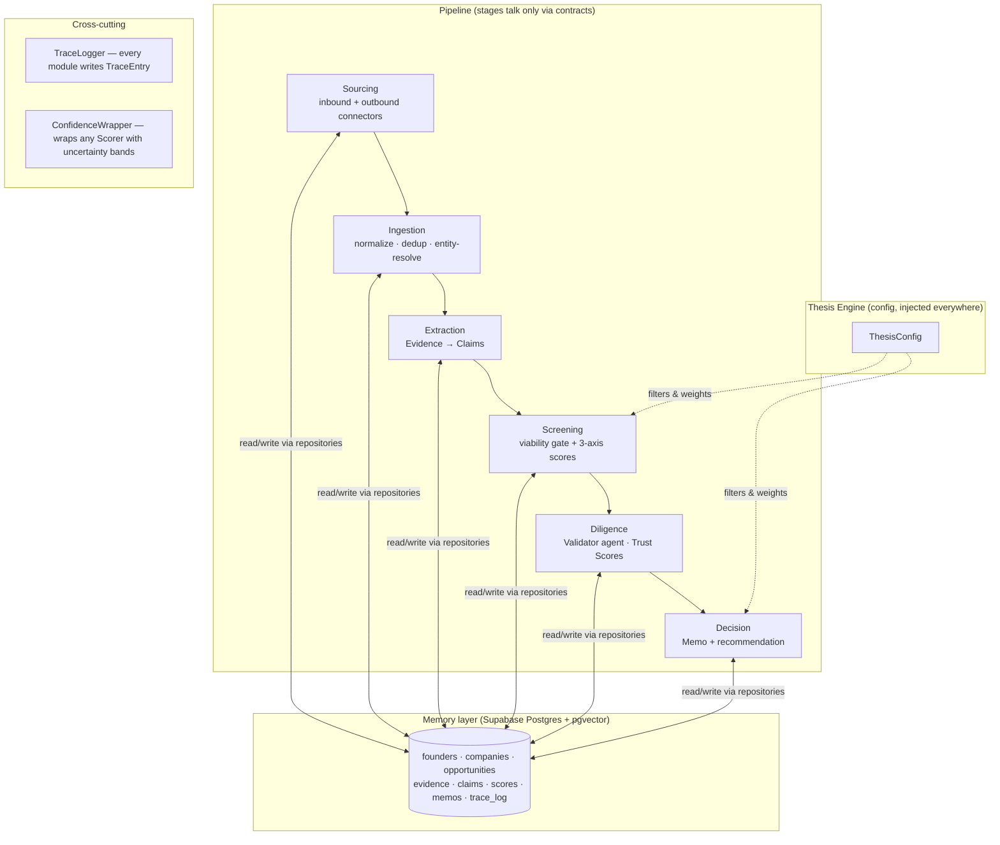

# BrainVC — Architecture

**The VC Brain** · Maschmeyer Group challenge · Hack-Nation 6th Global AI Hackathon
Design-only document. No implementation logic here — contracts, schema, and module boundaries only.

---

## 1. System Overview

BrainVC is a pipeline of independent modules connected **only by typed data contracts**,
running over a shared **Memory layer** (Supabase Postgres + pgvector), with a
**Thesis Engine** injected as configuration into every scoring and decision step.

The trust spine runs through everything: every artifact carries provenance
(source + timestamp), every claim links to evidence with a per-claim Trust Score,
a Validator agent cross-checks the primary extraction, and every module writes
step-level trace entries so the final memo can cite the exact data point behind
each conclusion.



Pipeline stages map to the brief: **Sourcing → Screening → Diligence → Decision**,
over Memory, under the Thesis Engine. Downstream stages (portfolio monitoring,
follow-on, fund ops, exit) are explicitly out of scope.

### Two tracks, one funnel

- **Inbound**: founder applies with deck + company name. Deck → Evidence → Claims → same funnel.
- **Outbound**: connectors scan public signals (GitHub, arXiv, hackathon results;
  LinkedIn-shaped data is synthetic — see DECISIONS.md D-7). Signals become Evidence
  attached to a provisional FounderRecord, scored identically. Strong matches
  trigger an outreach draft ("Activate"), which converges into the same Screening step.

---

## 2. Data Contracts (the modularity mechanism)

These are the **only** things modules may depend on. Defined once in
`backend/app/contracts/` as Pydantic models; the frontend consumes the same shapes
via the OpenAPI schema. Signatures only — no logic.

```python
# contracts/thesis.py
class ThesisConfig(BaseModel):
    id: UUID
    name: str                          # e.g. "Maschmeyer demo preset"
    sectors: list[str]                 # ["ai-native enterprise software"]
    stages: list[Stage]                # [PRE_SEED, SEED]
    geographies: list[str]             # ["US"]
    check_size_usd: int                # 100_000
    ownership_target_pct: float | None
    risk_posture: RiskPosture          # BACK_POTENTIAL_OVER_TRACTION | BALANCED | TRACTION_FIRST
    axis_weights: AxisWeights          # per-axis emphasis; NEVER used to average axes into one number
```

```python
# contracts/entities.py
class FounderRecord(BaseModel):
    id: UUID
    canonical_name: str
    handles: dict[str, str]            # {"github": "...", "linkedin": "...", "x": "..."}
    emails: list[str]
    bio: str | None
    first_seen_at: datetime
    # NOTE: FounderScore is NOT embedded here — it lives in Memory as an
    # append-only history keyed by founder_id (persists across applications).

class CompanyRecord(BaseModel):
    id: UUID
    name: str
    founder_ids: list[UUID]
    sector: str | None
    geography: str | None
    stage: Stage | None
    one_liner: str | None

class Opportunity(BaseModel):
    id: UUID
    company_id: UUID
    track: Track                       # INBOUND | OUTBOUND
    status: PipelineStatus             # SOURCED | SCREENED | IN_DILIGENCE | DECIDED
    created_at: datetime
```

```python
# contracts/evidence.py
class Evidence(BaseModel):
    id: UUID
    founder_id: UUID | None
    opportunity_id: UUID | None
    source_type: SourceType            # DECK_SLIDE | GITHUB | ARXIV | HACKATHON | SOCIAL | WEB | APPLICATION_FORM | SYNTHETIC
    source_ref: str                    # URL, or "deck.pdf#slide=4", or connector-specific locator
    content: str                       # the raw excerpt itself — verbatim, never paraphrased
    content_hash: str                  # for dedup
    retrieved_at: datetime             # when we fetched it (provenance)
    observed_at: datetime | None       # when the underlying event happened (for trends)
```

```python
# contracts/claims.py
class Claim(BaseModel):
    id: UUID
    opportunity_id: UUID
    category: ClaimCategory            # TRACTION | REVENUE | TEAM | MARKET | PRODUCT | OTHER
    text: str                          # atomic, checkable assertion
    status: ClaimStatus                # UNVERIFIED | SUPPORTED | CONTRADICTED | UNVERIFIABLE
    trust: TrustScore
    evidence_links: list[EvidenceLink] # every claim → its evidence, typed

class EvidenceLink(BaseModel):
    evidence_id: UUID
    relation: Relation                 # ASSERTS | SUPPORTS | CONTRADICTS

class TrustScore(BaseModel):
    value: float                       # 0.0–1.0
    level: TrustLevel                  # HIGH | MEDIUM | LOW | FLAGGED (derived, for UI)
    rationale: str                     # one sentence: why this level
    verification_method: str           # "internal cross-reference" | "external lookup" | "single-source, unverified"
```

```python
# contracts/scores.py
class AxisScore(BaseModel):
    id: UUID
    opportunity_id: UUID
    thesis_id: UUID                    # same founder scores differently under a different thesis
    axis: Axis                         # FOUNDER | MARKET | IDEA_VS_MARKET  (independent — never averaged)
    score: float                       # 0–100
    confidence: ConfidenceBand
    trend: Trend                       # IMPROVING | DECLINING | STABLE | INSUFFICIENT_HISTORY
    market_stance: Stance | None       # BULLISH | NEUTRAL | BEAR (market axis only)
    rationale: str
    evidence_ids: list[UUID]           # traceability: which evidence drove this score
    created_at: datetime

class ConfidenceBand(BaseModel):
    low: float
    high: float
    basis: str                         # honest label: "heuristic — evidence coverage + k-sample agreement"

class FounderScoreEntry(BaseModel):    # append-only; the persistent "credit score"
    id: UUID
    founder_id: UUID                   # keyed by PERSON, not opportunity — survives across applications
    score: float                       # 0–100
    confidence: ConfidenceBand
    inputs: dict                       # which signals contributed (JSON, for audit)
    created_at: datetime

class ColdStartAssessment(BaseModel):  # output of the cold-start scorer, feeds the FOUNDER axis
    founder_id: UUID
    dimension_scores: dict[str, DimensionScore]  # shipping_velocity, technical_depth, learning_rate, public_communication, domain_signal
    aggregate: float
    confidence: ConfidenceBand
    evidence_ids: list[UUID]
    known_unknowns: list[str]          # explicit list of what we could NOT observe
```

```python
# contracts/memo.py
class Memo(BaseModel):
    id: UUID
    opportunity_id: UUID
    thesis_id: UUID
    recommendation: Recommendation     # INVEST_100K | PASS | ESCALATE_TO_HUMAN
    sections: list[MemoSection]        # required: snapshot, hypotheses, SWOT, problem&product, traction&KPIs; plus bear case
    claim_ids: list[UUID]              # every claim cited in the memo, with trust badges rendered in UI
    gaps: list[str]                    # explicit "Cap table: not disclosed"-style flags — never silently omitted
    created_at: datetime

class MemoSection(BaseModel):
    kind: SectionKind
    markdown: str                      # inline claim references as [claim:UUID] tokens the UI resolves to badges
```

```python
# contracts/trace.py
class TraceEntry(BaseModel):
    id: UUID
    opportunity_id: UUID | None
    module: str                        # "extraction", "scoring.founder", "validation", ...
    step: str                          # human-readable step name
    input_refs: list[UUID]             # IDs of contract objects consumed
    output_refs: list[UUID]            # IDs of contract objects produced
    model: str | None                  # LLM model used, if any
    summary: str                       # one-line description of what happened
    created_at: datetime
```

**Contract rules (enforced by convention + review):**
1. Modules import from `contracts/` and `memory/` (repositories) only — never from another pipeline module.
2. Any module is replaceable if it honors its interface (§3).
3. Contracts are append-friendly: add optional fields freely; never repurpose existing ones mid-hackathon.

---## 3. Module Breakdown

Each module: single responsibility, inputs → outputs, exposed interface.
Interfaces are Python `Protocol`s — signatures only, no bodies.

### 3.1 Thesis Engine — `thesis/`
- **Responsibility:** load/validate `ThesisConfig`; expose the active thesis. Pure configuration, zero reasoning.
- **In:** JSON preset or UI edit. **Out:** `ThesisConfig`.
- Demo preset: US · pre-seed/seed · AI-native enterprise software · risk_posture=BACK_POTENTIAL_OVER_TRACTION.

```python
class ThesisProvider(Protocol):
    def get_active(self) -> ThesisConfig: ...
    def set_active(self, config: ThesisConfig) -> None: ...
```

### 3.2 Sourcing — `sourcing/connectors/`
- **Responsibility:** produce raw signals from one source. One connector = one file. Nothing else.
- **In:** connector-specific query/params. **Out:** `list[RawSignal]` (thin pre-Evidence shape: source_type, source_ref, content, observed_at).
- Planned connectors: `InboundDeckConnector` (PDF/markdown deck → per-slide RawSignals), `GitHubConnector` (repos, commit cadence, README quality), `ArxivConnector`, `HackathonResultsConnector` (seeded), `SyntheticProfileConnector` (LinkedIn-shaped synthetic data with seeded contradictions).

```python
class SourcingConnector(Protocol):
    source_type: SourceType
    def fetch(self, query: ConnectorQuery) -> list[RawSignal]: ...
```

Adding a connector = one new file + registry entry. Zero changes elsewhere.

### 3.3 Ingestion — `ingestion/`
- **Responsibility:** RawSignal → persisted `Evidence`: normalize, content-hash dedup, timestamp, embed (pgvector), and **entity-resolve** to a `FounderRecord`/`CompanyRecord` (exact handle/email match first, then name+company string similarity; embedding similarity only as a suggestion queue — see risk R-4).
- **In:** `list[RawSignal]`. **Out:** persisted `Evidence` rows linked to founder/opportunity.

```python
class Ingestor(Protocol):
    def ingest(self, signals: list[RawSignal]) -> list[Evidence]: ...

class EntityResolver(Protocol):
    def resolve(self, signal: RawSignal) -> FounderRecord | CompanyRecord | None: ...
```

### 3.4 Extraction — `extraction/`
- **Responsibility:** Evidence → atomic, checkable `Claim`s (LLM structured output, strict JSON schema). Every claim born with `status=UNVERIFIED`, trust `LOW`, and an `ASSERTS` link to its source evidence. Extraction **never** assigns high trust — that's the Validator's job (separation of powers).
- **In:** `list[Evidence]`. **Out:** `list[Claim]`.

```python
class ClaimExtractor(Protocol):
    def extract(self, evidence: list[Evidence]) -> list[Claim]: ...
```

### 3.5 Screening — `screening/` + `scoring/`
- **Responsibility (gate):** fast, cheap viability check (one LLM call) that kills clearly non-viable opportunities before expensive analysis. Out: pass/fail + reason (logged to trace).
- **Responsibility (scores):** three **independent** axis scorers behind one interface. Never averaged; each carries its own trend and confidence.
  - `FounderAxisScorer` — consumes the persistent FounderScore history **plus** the ColdStartAssessment (§3.6) when track record is thin.
  - `MarketAxisScorer` — sizing/competition/SWOT stance: bullish/neutral/bear.
  - `IdeaVsMarketAxisScorer` — does the idea survive scrutiny as-is, or is the team strong enough to pivot?

```python
class ViabilityGate(Protocol):
    def screen(self, opportunity: Opportunity, claims: list[Claim]) -> GateResult: ...

class Scorer(Protocol):
    axis: Axis
    def score(
        self, opportunity: Opportunity, thesis: ThesisConfig,
        claims: list[Claim], evidence: list[Evidence],
    ) -> AxisScore: ...
```

### 3.6 Cold-Start Scorer — `scoring/cold_start/`
- **Responsibility:** estimate founder potential from **public footprint alone** when there is little/no traction. The highest-value module; a plug-in *behind the same `Scorer`-adjacent interface* so it can be swapped (LLM-rubric v1 → feature-model v2) without touching the founder axis.
- **Method (v1):** extract structured footprint features from Evidence (shipping velocity, technical depth, learning rate, public communication, domain signal) → LLM rubric scores each dimension **with cited evidence IDs** → aggregate → `ColdStartAssessment` including explicit `known_unknowns`.
- **In:** `FounderRecord`, `list[Evidence]`. **Out:** `ColdStartAssessment` (consumed by FounderAxisScorer and appended to FounderScore history).

```python
class ColdStartScorer(Protocol):
    def assess(self, founder: FounderRecord, evidence: list[Evidence]) -> ColdStartAssessment: ...
```

### 3.7 Calibration — `scoring/calibration/`
- **Responsibility:** wrap ANY `Scorer` and attach an honest `ConfidenceBand`. v1 heuristic: band width driven by (a) count of independent evidence sources, (b) agreement across k=3 LLM samples, (c) share of claims still UNVERIFIED. The `basis` field always states this is heuristic, not statistical calibration — honesty is the feature.

```python
class ConfidenceWrapper(Protocol):
    def wrap(self, scorer: Scorer) -> Scorer: ...   # decorator pattern; returned Scorer emits bands
```

### 3.8 Diligence / Validator — `validation/`
- **Responsibility:** the adversarial second opinion. For each Claim: retrieve related Evidence from Memory (keyword + vector), cross-reference, optionally verify externally (Tavily if credits confirmed — see OPEN_QUESTIONS Q-6), then update `ClaimStatus` + `TrustScore` and emit contradiction flags **before** anything reaches the memo. Runs with a different prompt (and ideally different model/temperature) than extraction to reduce correlated errors.
- **In:** `list[Claim]`, Memory access. **Out:** updated `list[Claim]` + `list[ContradictionFlag]`.

```python
class Validator(Protocol):
    def validate(self, claims: list[Claim]) -> ValidationResult: ...
```

### 3.9 Decision / Memo — `memo/`
- **Responsibility:** compose the investment memo from validated claims + axis scores + thesis fit. Required sections: Company snapshot, Investment hypotheses, SWOT, Problem & product, Traction & KPIs — plus a Bear case (adversarial view). Missing data is **flagged, never fabricated** (`gaps` list → rendered as "Cap table: not disclosed"). Recommendation logic: thesis-fit filter → axis profile + trust profile → `INVEST_100K | PASS | ESCALATE_TO_HUMAN` (low-confidence or contradiction-heavy cases escalate rather than fake certainty).
- **In:** Opportunity + AxisScores + Claims + ThesisConfig. **Out:** `Memo`.

```python
class MemoComposer(Protocol):
    def compose(
        self, opportunity: Opportunity, scores: list[AxisScore],
        claims: list[Claim], thesis: ThesisConfig,
    ) -> Memo: ...
```

### 3.10 Memory — `memory/`
- **Responsibility:** ALL database access, as repositories. No other module touches SQL. Nothing is ever deleted or overwritten — scores and FounderScore entries are append-only so trends are queryable.

```python
class Repository(Protocol[T]):
    def save(self, obj: T) -> T: ...
    def get(self, id: UUID) -> T | None: ...
    def query(self, **filters) -> list[T]: ...

class EvidenceRepository(Repository[Evidence], Protocol):
    def search_similar(self, text: str, k: int) -> list[Evidence]: ...   # pgvector
```

### 3.11 Trace — `trace/`
- **Responsibility:** step-level chain-of-thought logging. Every module calls `log()` on entry/exit with input/output object IDs. The UI's "why?" click-through walks this log from memo → claim → evidence → source.

```python
class TraceLogger(Protocol):
    def log(self, entry: TraceEntry) -> None: ...
    def for_opportunity(self, opportunity_id: UUID) -> list[TraceEntry]: ...
```

### 3.12 Orchestrator — `pipeline/`
- **Responsibility:** wire the stages in order for one opportunity run. Plain sequential async function calling registered implementations — no agent framework (see DECISIONS D-2). The registry is where swapping happens.

### 3.13 API — `api/` · UI — `frontend/`
- **API:** FastAPI routers exposing: thesis get/set, apply (deck upload), run pipeline, ranked list, opportunity detail (axes + trends), memo, trace walk. OpenAPI schema is the frontend's contract.
- **UI (4 screens, in priority order):**
  1. **Ranked pipeline list** — opportunities scored under active thesis, momentum indicator.
  2. **Opportunity detail** — 3 axis cards (score + band + trend, explicitly NOT averaged), founder score history sparkline.
  3. **Memo view** — required sections, per-claim trust badges; clicking a badge opens the evidence excerpt + source ref + validator note (the traceability demo moment).
  4. **Thesis panel** — edit/switch preset; re-score visibly changes the ranking (the "same founder, different thesis" demo moment).

---

## 4. Data Model (Supabase Postgres + pgvector)

Append-only where history matters. Provenance (source + timestamp) on everything.

| Table | Key fields | Notes |
|---|---|---|
| `theses` | id PK · name · config JSONB · created_at | one row per thesis preset |
| `founders` | id PK · canonical_name · handles JSONB · emails TEXT[] · bio · first_seen_at | person, not company |
| `companies` | id PK · name · sector · geography · stage · one_liner | |
| `founder_companies` | founder_id FK · company_id FK · role | M:N |
| `opportunities` | id PK · company_id FK · track · status · created_at | one row per application/sourcing event |
| `evidence` | id PK · founder_id FK? · opportunity_id FK? · source_type · source_ref · content · content_hash UNIQUE · embedding VECTOR(1536) · retrieved_at · observed_at | dedup on content_hash; embedding for validator retrieval |
| `claims` | id PK · opportunity_id FK · category · text · status · trust_value · trust_level · trust_rationale · verification_method · created_at | per-claim Trust Score lives here |
| `claim_evidence` | claim_id FK · evidence_id FK · relation | ASSERTS / SUPPORTS / CONTRADICTS |
| `axis_scores` | id PK · opportunity_id FK · thesis_id FK · axis · score · conf_low · conf_high · conf_basis · trend · market_stance? · rationale · created_at | append-only → trend = compare latest vs prior |
| `axis_score_evidence` | axis_score_id FK · evidence_id FK | traceability for scores |
| `founder_scores` | id PK · founder_id FK · score · conf_low · conf_high · inputs JSONB · created_at | **append-only, keyed by founder — persists across applications, never resets** |
| `memos` | id PK · opportunity_id FK · thesis_id FK · recommendation · sections JSONB · gaps JSONB · created_at | |
| `memo_claims` | memo_id FK · claim_id FK | which claims the memo cites |
| `trace_log` | id PK · opportunity_id FK? · module · step · input_refs JSONB · output_refs JSONB · model · summary · created_at | step-level traceability |
| `contradiction_flags` | id PK · claim_id FK · conflicting_evidence_id FK · note · created_at | surfaced before memo |

**Trend mechanics:** trend fields require ≥2 snapshots. Synthetic seed data includes
back-dated evidence and founder_score entries so trends render on demo day
(`INSUFFICIENT_HISTORY` shown honestly otherwise).

---

## 5. Trust & Traceability Spine (end to end)

1. **Provenance at birth** — every `Evidence` row stores verbatim content, `source_ref`, `retrieved_at`. Nothing enters the system without a source.
2. **Claims are born skeptical** — extraction creates claims as `UNVERIFIED` / low trust, linked `ASSERTS` to source evidence. The extractor cannot bless its own output.
3. **Validator is a separate module with a separate prompt** — cross-references each claim against the rest of Memory (+ external lookup if available), upgrades/downgrades `TrustScore`, sets `verification_method`, and files `contradiction_flags`. Sits between Screening and Decision; the memo composer only sees post-validation claims.
4. **Scores cite evidence** — `axis_score_evidence` links each AxisScore to the evidence that drove it; ConfidenceBand carries an honest `basis` string.
5. **Memos cite claims** — sections embed `[claim:UUID]` tokens; UI renders trust badges; gaps are explicit strings, never invented numbers.
6. **Trace closes the loop** — every module logs input/output IDs, so the demo can walk: recommendation → memo section → claim → validator note → evidence excerpt → source ref.

**Cold-start + calibration plug-in path:** ColdStartScorer feeds FounderAxisScorer through the `ColdStartAssessment` contract; ConfidenceWrapper decorates any Scorer. Swapping either (better model, real calibration) changes one registry entry and nothing else.

---

## 6. Repo Structure

```
brainvc/
├── ARCHITECTURE.md · DECISIONS.md · OPEN_QUESTIONS.md
├── backend/
│   ├── app/
│   │   ├── contracts/          # THE data contracts (Pydantic) — single source of truth
│   │   ├── thesis/
│   │   ├── sourcing/
│   │   │   └── connectors/     # one file per connector + registry
│   │   ├── ingestion/          # normalize, dedup, entity resolution
│   │   ├── extraction/         # Evidence → Claims
│   │   ├── screening/          # viability gate
│   │   ├── scoring/
│   │   │   ├── axes/           # founder.py · market.py · idea_vs_market.py
│   │   │   ├── cold_start/     # swappable cold-start scorer
│   │   │   └── calibration/    # ConfidenceWrapper
│   │   ├── validation/         # validator agent + contradiction flags
│   │   ├── memo/
│   │   ├── memory/             # repositories — ONLY module that touches SQL
│   │   ├── trace/
│   │   ├── pipeline/           # orchestrator + module registry
│   │   └── api/                # FastAPI routers (OpenAPI = frontend contract)
│   ├── seeds/                  # synthetic founders, decks, seeded contradictions, back-dated history
│   ├── migrations/             # Supabase SQL
│   └── tests/                  # contract round-trip + one golden-path pipeline test
└── frontend/                   # Lovable-generated, then refined; consumes OpenAPI shapes
```

Folder boundaries = module boundaries = contract boundaries. A module may import
`contracts/`, `memory/`, `trace/` — never a sibling pipeline module.
